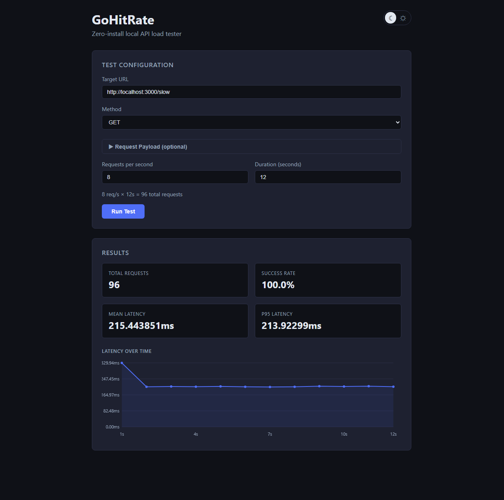
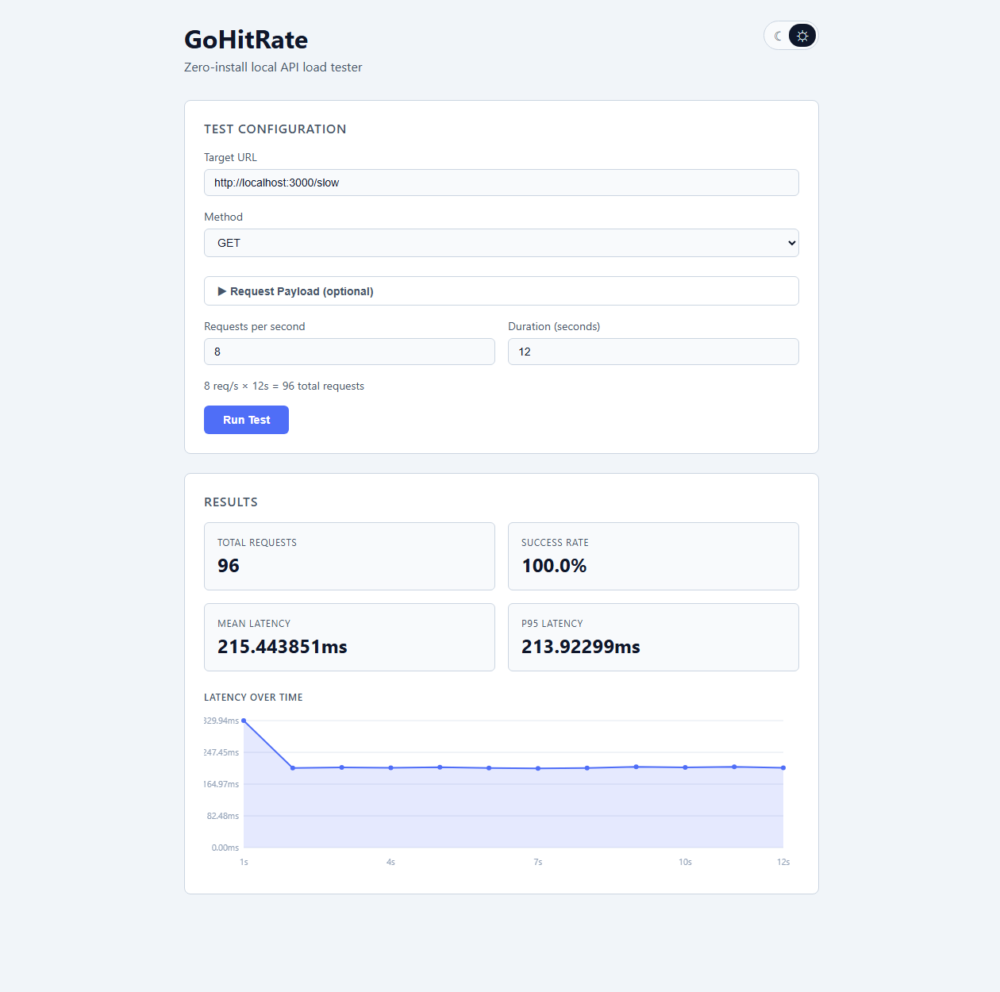
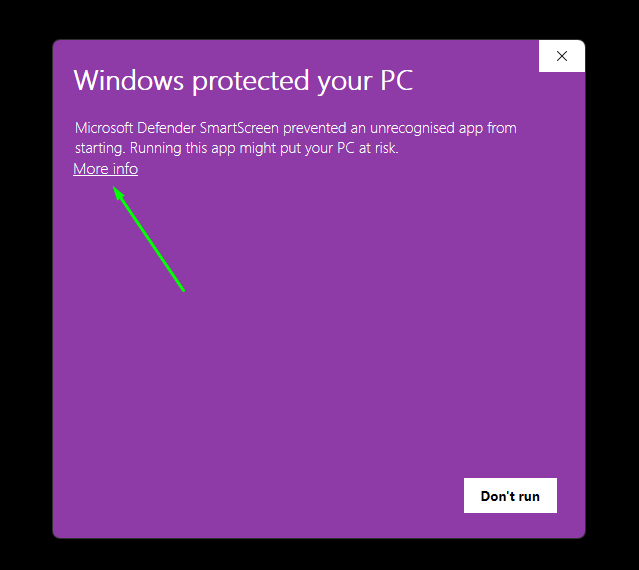
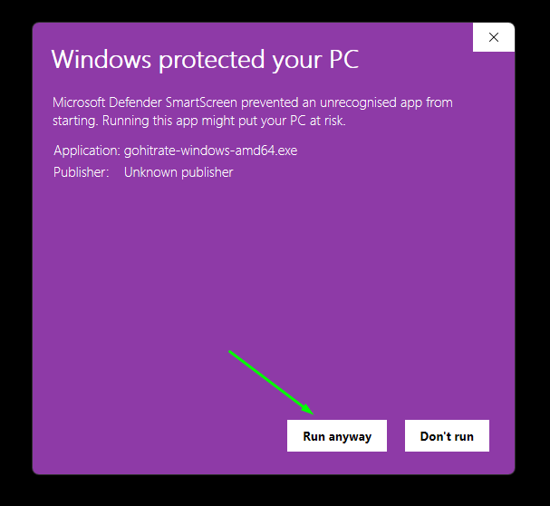

# GoHitRate

> Zero-install local API load tester. Download, run, done.

GoHitRate is a lightweight tool for load testing local HTTP and HTTPS API endpoints during development. No installation, no configuration files, no dependencies. Download the binary, run it, and your browser opens ready to go.

## Features

- Single binary — no runtime, no npm, no Python required
- Supports HTTP and HTTPS endpoints
- Configure method (GET, POST, PUT, PATCH, DELETE), requests per second and duration
- Add custom request headers and JSON request body for authenticated or data endpoints
- Results include total requests, success rate, mean latency, P95 latency and a per-second latency graph
- Dark and light theme with system preference detection
- Only targets local and private network addresses by default — safe to run without risk of hitting public APIs accidentally
- Builds available for Windows, macOS, and Linux

## UI

☾ Dark mode

☼ Light mode

## Download & Run

Grab the binary for your platform from the [Releases](https://github.com/kmskuus/gohitrate/releases) page.

**Windows:** double-click `gohitrate-windows-amd64.exe`  
**macOS/Linux:** `chmod +x gohitrate-* && ./gohitrate-*`

Browser opens at `http://localhost:8080`

### Windows SmartScreen warning

Windows may show a security warning the first time you run GoHitRate. This is expected for unsigned open source software. To proceed:

1. Click **More info**

2. Click **Run anyway**

## Why a browser UI?

A native desktop GUI would mean platform-specific code and a much larger binary. Instead GoHitRate starts a local web server and opens your browser automatically. The entire frontend is embedded inside the binary — no loose files or extra installs.

## Built With

- [Go](https://golang.org/): backend, HTTP server, binary compilation
- [Vegeta](https://github.com/tsenart/vegeta): load testing engine
- HTML, CSS, vanilla JavaScript: frontend embedded into the binary via `go:embed`

## Development

Uses a VS Code devcontainer. Open in VS Code with the Dev Containers extension and select **Reopen in Container**.

## Disclaimer

Claude AI (Anthropic) was used during development. All decisions, testing, and review were done by the author.

## License

[MIT](LICENSE)
